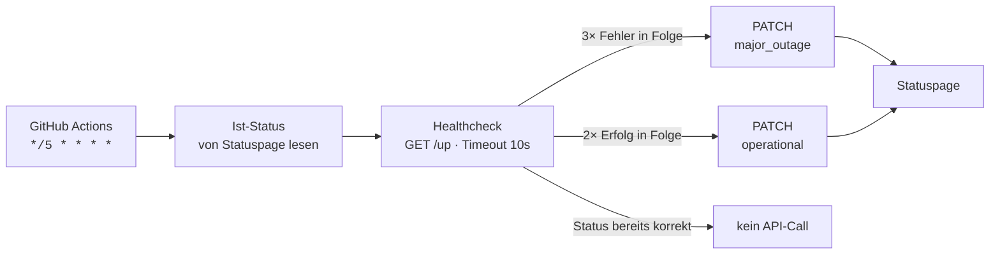

<div align="center">

<picture>
  <source media="(prefers-color-scheme: dark)" srcset="assets/firntech-logo-white.png">
  
</picture>

# Statuspage Monitor

**Abhängigkeitsfreies Uptime-Monitoring für Atlassian Statuspage, betrieben von GitHub Actions.**<br>
Alle 5 Minuten ein HTTP-Healthcheck, das Ergebnis landet direkt in den Statuspage-Components.

<br>

[](https://github.com/VALCODE-CH/Statuspage/actions/workflows/monitor.yml)
[](https://github.com/VALCODE-CH/Statuspage/actions/workflows/validate.yml)
[](https://firntech.statuspage.io/)

</div>

---

## Funktionsweise



Pro Lauf und pro Monitor:

1. **Aktuellen Component-Status lesen**
   `GET https://api.statuspage.io/v1/pages/{page_id}/components/{component_id}`
2. **Healthcheck ausführen** – HTTP-Request auf die konfigurierte URL mit Timeout (Standard 10 Sekunden).
   Erfolgreich ist nur ein erwarteter Statuscode (Standard: genau `200`).
3. **Wiederholen, bis ein Ergebnis feststeht**:
   * `failure_threshold` aufeinanderfolgende Fehlversuche → **DOWN**
   * die nötige Anzahl aufeinanderfolgender Erfolge → **UP**
4. **Statuspage aktualisieren** – nur wenn sich der Status tatsächlich ändert:

   ```http
   PATCH https://api.statuspage.io/v1/pages/{page_id}/components/{component_id}
   Authorization: OAuth <STATUSPAGE_API_KEY>
   Content-Type: application/json

   {"component": {"status": "operational"}}
   ```

Weil der Ist-Zustand vor jedem Lauf von Statuspage gelesen wird, braucht das Projekt **keinen eigenen
Zustandsspeicher**.

---

## Weitere Endpoints hinzufügen

> Ein Monitor = ein Statuspage-Component. Beliebig viele davon, **ein einziger Eintrag pro Endpoint** –
> Code und Workflow müssen nie angefasst werden.

**Schritt 1:** Component in Statuspage anlegen (**Components → Add a component**).

**Schritt 2:** Component-ID nachschlagen:

```bash
export STATUSPAGE_API_KEY=...
python3 monitor.py --list-components
```

```text
page_id      t7lm3xn8kz9q   CoreFit Status
  component  9k2f4b7c1d3e   CoreFit API   [operational]
  component  aa11bb22cc33   Billing API   [major_outage]
  group      gg99hh88ii77   Backend       [operational]
```

**Schritt 3:** Monitor in `monitors.json` ergänzen – die ID direkt eintragen:

```json
{
  "monitors": [
    {
      "name": "CoreFit API",
      "url": "https://api.core-fit.app/up",
      "component_id": "${STATUSPAGE_COMPONENT_ID}"
    },
    {
      "name": "Billing API",
      "url": "https://billing.core-fit.app/health",
      "component_id": "aa11bb22cc33",
      "timeout_seconds": 5,
      "expected_status": [200, 204]
    },
    {
      "name": "Marketing-Site",
      "url": "https://core-fit.app/",
      "component_id": "d4e5f6a7b8c9",
      "method": "HEAD",
      "down_status": "partial_outage"
    }
  ]
}
```

Committen, fertig. Der nächste geplante Lauf prüft alle Monitore und aktualisiert jeden Component einzeln.
